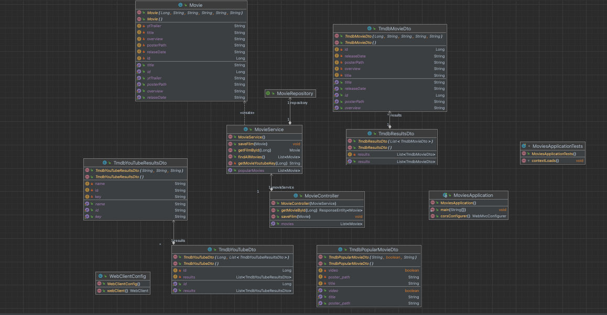

# Javact

## Demo on Heroku [MovieSpot](https://moviesspot.herokuapp.com/)

<h1 style="color: red;">Important!</h1>
The project is still under development!<h7 style="color: red;"> Currently, the functionality is very limited</h7>. Below next section is which of things that will be implemented:

## Prerequisites

#### - Spring Boot (version 3.0.6)
#### - Java 8 (or later)
#### - Maven (version 3.9.1)
#### - npm (version 9.5.1)
#### - PostgreSQL/MySQL or any other preferred database server

## Whats doing app?
This application is a Java-based backend for a movie-related web application. Here's an overview of what this application does:

The main class MoviesApplication is the entry point of the application. It uses the Spring Boot framework and sets up the necessary configurations for running the application.

The MovieService class is a service component responsible for fetching and manipulating movie data. It uses the MovieRepository to interact with the database and the WebClient to make HTTP requests to retrieve movie data from the "https://api.themoviedb.org/3" API.

The MovieRepository is a Spring Data JPA repository interface for performing CRUD operations on the Movie entity. It extends the JpaRepository interface.

The Movie class is a JPA entity representing a movie. It has various properties such as id, title, overview etc.

The MovieController class is a RESTful controller that handles incoming HTTP requests related to movies. It has endpoints for retrieving popular movies, retrieving a movie by its ID, and saving a movie.

The WebClientConfig class is a configuration class that provides a WebClient bean, which is used to make HTTP requests to the movie API.

The TmdbMovieDto, TmdbResultsDto, TmdbYouTubeDto, and TmdbYouTubeResultsDto classes are DTO (Data Transfer Object) classes used to deserialize the JSON responses from the movie API.

Overall, this application allows clients to retrieve popular movies and movie details from the movie API, as well as save movies to the database. It serves as the backend logic for a movie-related web application.
## What is the goal?
The goal of this project is to create a fully functional platform for movie-related activities. Here are some of the future features that are planned:

- [ ] Displaying all films in a list on the site, not limited to popular movies only.
- [ ] Saving movies in the database, allowing users to keep track of recently viewed movies and create a list of favorite movies.
- [ ] Implementing a user authentication and authorization system, possibly using JWT (JSON Web Tokens) or OAuth for secure access to the platform.
- [ ] Adding a system for users to write and view movie reviews, providing valuable insights and recommendations.
- [ ] Incorporating a booking system for movies in cinemas, allowing users to book tickets for specific showtimes and locations.

By implementing these features, the platform aims to provide an immersive and comprehensive movie experience for users, enabling them to discover, review, and book movies seamlessly within a single platform.

## Design

### Design patterns usage examples
* Service Layer [MovieService.java](https://github.com/Nosieek/Javact/blob/master/backend/movies/src/main/java/com/javact/movies/services/MovieService.java)

### Diagram

